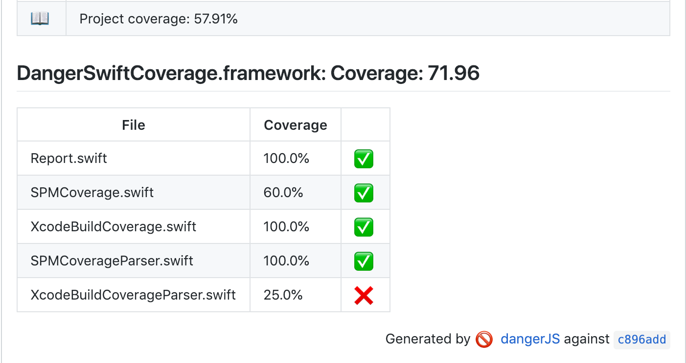
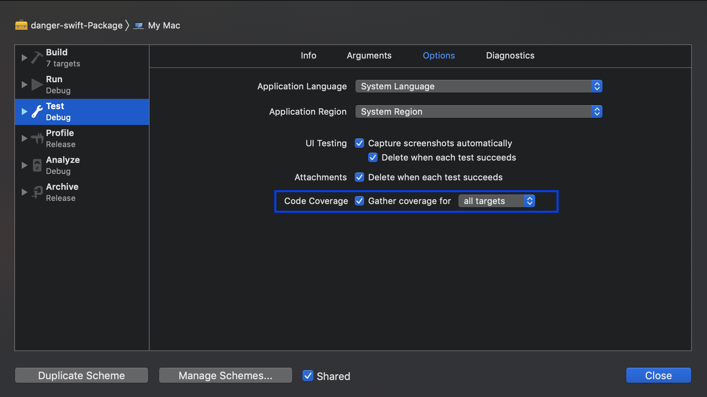

# DangerSwiftCoverage

[Danger-Swift](https://github.com/danger/swift) plugin to show the coverage of the modified/created files.



## Getting Started

### Install DangerSwiftCoverage
#### Swift Package Manager (More performant)
You can use a "full SPM" solution to install both `danger-swift` and `DangerSwiftCoverage`.

- Add to your `Package.swift`:

```swift
let package = Package(
    ...
    products: [
        ...
        .library(name: "DangerDeps", type: .dynamic, targets: ["DangerDependencies"]), // dev
        ...
    ],
    dependencies: [
        ...
        // Danger Plugins
        .package(url: "https://github.com/f-meloni/danger-swift-coverage", from: "0.1.0") // dev
        ...
    ],
    targets: [
        .target(name: "DangerDependencies", dependencies: ["Danger", "DangerSwiftCoverage"]), // dev
        ...
    ]
)
```

- Add the correct import to your `Dangerfile.swift`:
```swift
import DangerSwiftCoverage

Coverage.xcodeBuildCoverage(derivedDataFolder: "Build", 
                            minimumCoverage: 50, 
                            excludedTargets: ["DangerSwiftCoverageTests.xctest"])
```

- Create a folder called `DangerDependencies` on `Sources` with an empty file inside like [Fake.swift](Sources/DangerDependencies/Fake.swift)
- To run `Danger` use `swift run danger-swift command`
- (Recommended) If you are using SPM to distribute your framework use [Rocket](https://github.com/f-meloni/Rocket) or similar to comment out all the dev depencencies from your `Package.swift` and avoid them to be downloaded and compiled with your framework.

#### Marathon
- Add this to your `Dangerfile.swift`

```swift
import DangerSwiftCoverage // package: https://github.com/f-meloni/danger-swift-coverage

Coverage.xcodeBuildCoverage(derivedDataFolder: "Build", 
                            minimumCoverage: 50, 
                            excludedTargets: ["DangerSwiftCoverageTests.xctest"])
```

- (Recommended) Cache the `~/.danger-swift` folder

### Gather Coverage

- Enable "Gather the Coverage" on Xcode 



or, on your CI, execute: 
```bash
xcodebuild test -scheme DangerSwiftCoverage-Package -derivedDataPath Build/ -enableCodeCoverage YES
```

## License
This project is licensed under the terms of the MIT license. See the LICENSE file.
